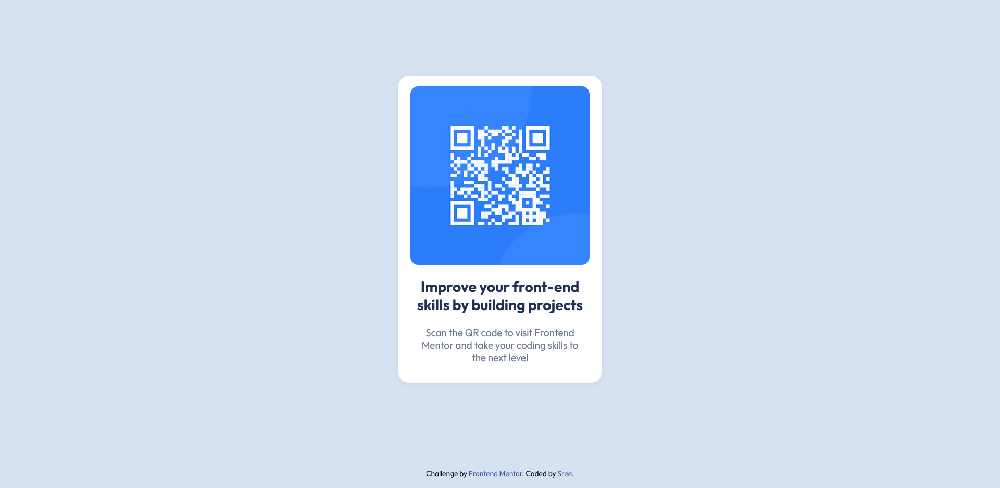

# Frontend Mentor - QR code component solution

This is my solution to the [QR code component challenge on Frontend Mentor](https://www.frontendmentor.io/challenges/qr-code-component-iux_sIO_H). It's a beginner-friendly project that helped reinforce my understanding of basic layout structuring, typography, and mobile-first design using HTML and CSS.

## Table of contents

- [Overview](#overview)
  - [Screenshot](#screenshot)
  - [Links](#links)
- [My process](#my-process)
  - [Built with](#built-with)
  - [What I learned](#what-i-learned)
  - [Continued development](#continued-development)
  - [Useful resources](#useful-resources)
- [Author](#author)

## Overview

### Screenshot



### Links

- Solution URL: [GitHub Repository](https://github.com/Imissh3r/qr-code-component)
- Live Site URL: [Live Preview](https://imissh3r.github.io/qr-code-component/)

## My process

### Built with

- Semantic **HTML5**
- **CSS** custom properties
- **Flexbox** layout
- **Mobile-first** workflow
- Google Fonts (Outfit)

### What I learned

This project helped me practice and refine the following:

- Structuring HTML semantically
- Centering a component vertically and horizontally using Flexbox
- Using mobile-first principles for responsive design
- Applying consistent spacing and visual hierarchy through typography

A code snippet I’m proud of:

```css
.qr-container {
  background-color: hsl(0, 0%, 100%);
  display: flex;
  flex-direction: column;
  gap: 1rem;
  align-items: center;
  padding: 1.2rem;
  height: 440px;
  width: 280px;
  border-radius: 16px;
  box-shadow: 0 2px 6px rgba(0, 0, 0, 0.05);
}
```

### Continued development

I'd like to keep improving on:

- Writing more scalable CSS using methodologies like utility-first frameworks (e.g., Tailwind CSS)
- Accessibility features like `alt` text
- Responsive design beyond just small components (media queries, fluid grids)

### Useful resources

- [Frontend Mentor Guide](https://www.frontendmentor.io/resources) – Helped me understand the project expectations.
- [CSS Flexbox Guide - MDN](https://developer.mozilla.org/en-US/docs/Web/CSS/CSS_flexible_box_layout/Basic_Concepts_of_Flexbox) – Crucial in aligning and centering the QR component.

## Author

- GitHub - [@Imissh3r](https://github.com/Imissh3r)
- Frontend Mentor - [@Imissh3r](https://www.frontendmentor.io/profile/Imissh3r)
